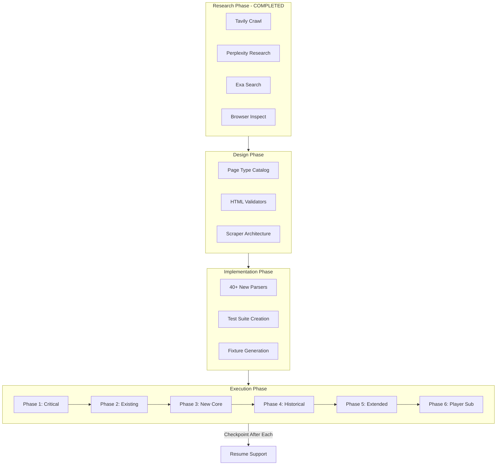

# Comprehensive Basketball-Reference Fixture Rebuild

## Executive Summary

Transform test infrastructure from 102 outdated fixtures to ~433 fixtures covering 50+ page types across BAA/ABA/NBA history (1946-2025). Implement chaos-engineered scraping infrastructure with resilience, validation, and full test coverage.

**Scale**: 102 -> 433 fixtures | 12 -> 50+ page types | remaining issues: missing fixtures tracked in Phase 2 closure

**Time Estimate**: 80-120 hours across multiple work sessions

---

## Discovered Page Types (50+ Total)

### Currently Implemented (12 types)

1. Player profile pages
2. Player game logs (regular + playoff)
3. Player season totals
4. Player advanced season totals
5. Season standings
6. Season schedules (full + monthly)
7. Daily box scores index
8. Game box scores
9. Play-by-play
10. Daily leaders
11. Search results
12. (Contracts - wrapper exists but not integrated)

### Newly Discovered (40+ types)

**Coaches & Personnel:**

- `/coaches/{coachid}.html` - Coach profile and record
- `/executives/{executiveid}/` - Executive/GM pages
- `/referees/` - Referee directory and pages

**Draft:**

- `/draft/NBA_{year}.html` - Annual draft results
- `/draft/combine/{year}.html` - Draft combine measurements
- `/draft/lottery_{year}.html` - Draft lottery results
- `/draft/` - Draft history index

**Awards:**

- `/awards/mvp.html` - MVP history
- `/awards/dpoy.html` - Defensive Player of Year
- `/awards/roy.html` - Rookie of the Year
- `/awards/smoy.html` - Sixth Man of the Year
- `/awards/mip.html` - Most Improved Player
- `/awards/coy.html` - Coach of the Year
- `/awards/all_league.html` - All-League teams (All-NBA/All-ABA)
- `/awards/all_rookie.html` - All-Rookie teams
- `/awards/all_defense.html` - All-Defensive teams
- `/awards/hof.html` - Hall of Fame

**Playoffs:**

- `/playoffs/NBA_{year}.html` - Playoff bracket/results
- `/playoffs/{year}-nba-{round}-{teams}.html` - Series pages (e.g., "2013-nba-eastern-conference-finals-pacers-vs-heat")
- `/playoffs/NBA_{year}_per_game.html` - Playoff stats

**All-Star:**

- `/allstar/NBA_{year}.html` - All-Star Game results
- `/allstar/` - All-Star Game history

**Leaders:**

- `/leaders/` - Leaders index
- `/leaders/{stat}_career.html` - Career leaders
- `/leaders/{stat}_active.html` - Active player leaders
- `/trailers/{stat}_yearly_p.html` - Progressive/trailing leaders

**Team Pages:**

- `/teams/{team}/` - Franchise history
- `/teams/{team}/{year}.html` - Season page (roster, stats)
- `/teams/{team}/{year}_schedule.html` - Team schedule
- `/teams/{team}/{year}_gamelog.html` - Team game log
- `/teams/{team}/draft.html` - Team draft history

**League Statistics Variants:**

- `/leagues/NBA_{year}_per_game.html` - Per-game stats
- `/leagues/NBA_{year}_per_minute.html` - Per-36-minute stats
- `/leagues/NBA_{year}_per_poss.html` - Per-100-possession stats
- `/leagues/NBA_{year}_shooting.html` - Shooting stats
- `/leagues/NBA_{year}_adj_shooting.html` - Adjusted shooting
- `/leagues/NBA_{year}_opponent.html` - Opponent stats
- `/leagues/NBA_{year}_team.html` - Team stats
- `/leagues/NBA_{year}_team_opponent.html` - Team opponent stats
- `/leagues/NBA_{year}_leaders.html` - Season leaders
- `/leagues/NBA_{year}_rookies.html` - Rookie stats
- `/leagues/NBA_{year}_standings_by_date.html` - Historical standings

**Player Sub-pages:**

- `/players/{l}/{id}/splits/{year}` - Situational splits
- `/players/{l}/{id}/shooting/{year}` - Shooting zones/charts
- `/players/{l}/{id}/advanced/{year}` - Advanced stats
- `/players/{l}/{id}/per_minute/{year}` - Per-36 stats
- `/players/{l}/{id}/per_poss/{year}` - Per-100-possession stats

**Historical Leagues:**

- `/leagues/BAA_{year}.html` - BAA seasons (1946-1949)
- `/leagues/ABA_{year}.html` - ABA seasons (1967-1976)
- `/nbl/` - NBL (pre-BAA) pages

**Other Leagues:**

- `/gleague/` - G-League pages
- `/wnba/` - WNBA pages
- `/international/` - International basketball

**Box Score Variants:**

- `/boxscores/{gameid}_shooting.html` - Game shooting charts
- `/boxscores/{gameid}_advanced.html` - Advanced box score
- `/boxscores/{gameid}_four_factors.html` - Four factors analysis

---

## Complete URL Manifest (Current: ~433 Pages)

Source of truth: `src/scraper/scripts/fixture_manifest.json`

### Phase 1: Critical Fixes (8 pages, 30 min)

**Fixes 4 test failures + 11 conftest failures**

```
# Fix conftest.py typo first (2 min)
tests/end to end/conftest.py:16 - request parameter

# Then scrape these:
/leagues/NBA_2000.html → standings/2000.html
/leagues/NBA_2001.html → standings/2001.html
/leagues/NBA_2002.html → standings/2002.html
/leagues/NBA_2005.html → standings/2005.html
/leagues/NBA_2018.html → standings/2018.html
/leagues/NBA_2019.html → standings/2019.html
/leagues/NBA_2020.html → standings/2020.html
/leagues/NBA_2018_totals.html → players_season_totals/2018.html (data drift fix)
```

### Phase 2: Existing Types - Historical Coverage (163 pages, 9 hours)

**Season Totals (30 pages):** BAA (4) + ABA (9) + NBA (17 sampled years)

```
/leagues/BAA_1947.html, BAA_1948.html, BAA_1949.html, BAA_1950.html
/leagues/ABA_1968.html, ABA_1970.html, ABA_1972.html, ABA_1974.html, ABA_1976.html, ...
/leagues/NBA_1950_totals.html, 1960, 1970, 1980, 1990, 2000, 2005, 2010, 2015, 2018, 2020, 2024, 2025, ...
```

**Advanced Stats (25 pages):** Sampled years 2001-2025

```
/leagues/NBA_2001_advanced.html, 2005, 2010, 2015, 2018, 2020, 2022, 2024, 2025, ...
```

**Schedules (35 pages):** Full season + monthly for key years

```
/leagues/NBA_{year}_games.html - for years: 1950, 1960, 1970, 1980, 1990, 2000, 2005, 2010, 2015, 2018, 2020, 2024, 2025
/leagues/NBA_2001_games-{month}.html - All 9 months
/leagues/NBA_2018_games-{month}.html - All 9 months
```

Note: monthly schedules can be sparse; use a lighter validator (`schedule_month`), and use `schedule_early` for early seasons with fewer rows.

**Box Scores (25 pages):** Representative games across eras

```
/boxscores/?month={m}&day={d}&year={y} - 10 dates
/boxscores/{gameid}.html - 15 games across eras
```

**Play-by-Play (15 pages):** Various games

```
/boxscores/pbp/{gameid}.html - 15 games from different eras
```

**Player Profiles (20 pages):** Mix of eras, positions, accolades

```
/players/j/jamesle01.html - LeBron James
/players/j/jordami01.html - Michael Jordan
/players/c/chambwi01.html - Wilt Chamberlain
/players/b/bryanko01.html - Kobe Bryant
/players/d/duncati01.html - Tim Duncan
... (15 more covering different eras)
```

**Player Game Logs (20 pages):** Various players/seasons

```
/players/w/westbru01/gamelog/2017
/players/j/jamesle01/gamelog/2020
... (18 more)
```

**Search Results (10 pages):** Various queries

```
/search/search.fcgi?search={term} - Various terms
```

Note: some queries resolve to direct player pages (e.g., lebron). Validate those with `player_profile`.

**Phase 2 Closure Checklist (Missing Fixtures)**

Missing files to re-scrape or replace:

- `tests/integration/files/standings/1950.html`
  - `tests/integration/files/boxscores/201606190GSW.html`
  - `tests/integration/files/boxscores/202010110MIA.html`
  - `tests/integration/files/boxscores/202107200MIL.html`
  - `tests/integration/files/boxscores/202206160BOS.html`
  - `tests/integration/files/play_by_play/199806140UTA.html`
  - `tests/integration/files/play_by_play/201606190GSW.html`
  - `tests/integration/files/play_by_play/202010110MIA.html`
  - `tests/integration/files/play_by_play/202107200MIL.html`
  - `tests/integration/files/play_by_play/202206160BOS.html`
- `tests/integration/files/players/onealsh01.html`
- `tests/integration/files/players/duranke01.html`
- `tests/integration/files/players/antetgi01.html`
  - `tests/integration/files/players/johnsma02.html`
- `tests/integration/files/players/mikange01.html`
  - `tests/integration/files/players/edwaran01.html`
- `tests/integration/files/boxscores/shot_chart/202306120DEN.html`
- `tests/integration/files/boxscores/shot_chart/202406170BOS.html`
- `tests/integration/files/boxscores/plus_minus/202306120DEN.html`
- `tests/integration/files/boxscores/plus_minus/202406170BOS.html`

Re-scrape procedure (PowerShell):

```
$env:PYTHONPATH='.'
uv run python -m src.scraper.scripts.scrape_fixtures.main --phase 2_existing_types --concurrency 1 --retry-failures --no-skip-existing
uv run python src/scraper/scripts/validate_fixtures.py --manifest src/scraper/scripts/fixture_manifest.json --phase 2_existing_types
```

### Phase 3: New Page Types - Core Additions (130 pages, 10 hours)

**Coaches (15 pages):**

```
/coaches/jacksph01c.html - Phil Jackson
/coaches/popovgr99c.html - Gregg Popovich
/coaches/rileypa01c.html - Pat Riley
/coaches/auerbre99c.html - Red Auerbach
... (11 more legendary/active coaches)
```

**Draft (30 pages):**

```
/draft/NBA_1950.html, 1960, 1970, 1980, 1990, 2000, 2005, 2010, 2015, 2018, 2020, 2022, 2024, 2025
/draft/combine/2018.html, 2020, 2022, 2024, 2025
/draft/lottery_2018.html, 2020, 2022, 2024, 2025
```

**Awards (25 pages):**

```
/awards/mvp.html
/awards/dpoy.html
/awards/roy.html
/awards/smoy.html
/awards/mip.html
/awards/coy.html
/awards/all_league.html
/awards/all_rookie.html
/awards/all_defense.html
/awards/hof.html
... (15 more award-specific pages)
```

**Playoffs (30 pages):**

```
/playoffs/NBA_1950.html, 1960, 1970, 1980, 1990, 2000, 2005, 2010, 2015, 2018, 2020, 2024, 2025
/playoffs/2024-nba-finals-celtics-vs-mavericks.html
/playoffs/2023-nba-finals-nuggets-vs-heat.html
... (15 notable series pages)
```

**All-Star (20 pages):**

```
/allstar/NBA_1951.html, 1960, 1970, 1980, 1990, 2000, 2005, 2010, 2015, 2018, 2020, 2024, 2025
... (more All-Star game pages)
```

**Leaders (20 pages):**

```
/leaders/pts_career.html
/leaders/trb_career.html
/leaders/ast_career.html
/leaders/pts_active.html
/trailers/pts_yearly_p.html
... (15 more leader pages)
```

**Team Pages (30 pages):**

```
/teams/BOS/2024.html, BOS/2020, BOS/2010, BOS/2000, BOS/1980, BOS/1960
/teams/LAL/2024.html, LAL/2020, LAL/2010, LAL/2000, LAL/1980, LAL/1960
/teams/CHI/1996.html (Jordan's Bulls)
... (teams from different eras)
```

**Executives (10 pages):**

```
/executives/{id}/ - 10 notable GMs/executives
```

**Team Sub-pages (30 pages):**

```
/teams/{team}/{year}_schedule.html - 10 examples
/teams/{team}/{year}_gamelog.html - 10 examples
/teams/{team}/draft.html - 10 franchises
```

### Phase 4: Historical Leagues (45 pages, 4 hours)

**BAA (12 pages):**

```
/leagues/BAA_1947.html, 1948, 1949, 1950
/leagues/BAA_{year}_totals.html - 4 years
/leagues/BAA_{year}_games.html - 4 years
```

**ABA (36 pages):**

```
/leagues/ABA_{year}.html - 10 seasons sampled
/leagues/ABA_{year}_totals.html - 10 seasons
/leagues/ABA_{year}_games.html - 10 seasons
/players/{aba_player}.html - 6 ABA legends
```

**NBL (10 pages):**

```
/nbl/players/{id}n.html - 10 NBL players
```

**Historical (22 pages):**

```
/leagues/NBA_1950_rookies.html, 1960, 1970, 1980, 1990, 2000
/leagues/NBA_{year}_standings_by_date.html - 6 examples
/leagues/NBA_{year}_leaders.html - 10 examples
```

### Phase 5: Extended League Stats (44 pages, 3 hours)

**Per-Game Stats (12 pages):**

```
/leagues/NBA_{year}_per_game.html - 12 seasons sampled
```

**Per-Minute Stats (12 pages):**

```
/leagues/NBA_{year}_per_minute.html - 12 seasons
```

**Per-Possession Stats (12 pages):**

```
/leagues/NBA_{year}_per_poss.html - 12 seasons
```

**Shooting Stats (12 pages):**

```
/leagues/NBA_{year}_shooting.html - 12 seasons
```

**Adjusted Shooting (12 pages):**

```
/leagues/NBA_{year}_adj_shooting.html - 12 seasons
```

### Phase 6: Player Sub-Pages (43 pages, 6 hours)

**Splits (20 pages):**

```
/players/{id}/splits/{year} - 20 players/seasons
```

**Shooting (20 pages):**

```
/players/{id}/shooting/{year} - 20 players/seasons
```

**Advanced (20 pages):**

```
/players/{id}/advanced/{year} - 20 players/seasons
```

**Per-Minute (20 pages):**

```
/players/{id}/per_minute/{year} - 20 players/seasons
```

**Per-Possession (20 pages):**

```
/players/{id}/per_poss/{year} - 20 players/seasons
```

**Playoffs (20 pages):**

```
/players/{id}/playoffs/{year} - 20 players/seasons
```

---

## Total Fixture Count: ~433 Pages


| Phase               | Page Types                       | Count    | Scrape Time  |
| ------------------- | -------------------------------- | -------- | ------------ |
| 1. Critical         | Standings + 2018 totals          | 8        | 30 min       |
| 2. Existing         | Current 12 types                 | 163      | 9 hrs        |
| 3. New Core         | Coaches, draft, awards, playoffs | 130      | 10 hrs       |
| 4. Historical       | BAA, ABA, NBL                    | 45       | 4 hrs        |
| 5. Extended Stats   | Per-game, per-poss, shooting     | 44       | 3 hrs        |
| 6. Player Sub-pages | Splits, shooting, advanced       | 43       | 6 hrs        |
| **Total**           | **50+ types**                    | **~433** | **32.5 hrs** |


**With development time (scraper, parsers, tests): 80-120 hours**

---

## Architecture




---

## Implementation Strategy

### Scraper Design (Chaos Engineering Principles)

**Core Requirements:**

1. **Resilience**: Handle 429/403 gracefully, exponential backoff
2. **Checkpointing**: Save progress every 10 pages, resume from checkpoint
3. **Validation**: Verify HTML structure matches expected elements
4. **Rate Limiting**: 3-5 second random delays, respect robots.txt
5. **Monitoring**: Log success/failure rates, response times, error patterns
6. **Graceful Degradation**: Continue on single page failures, report at end

**Entry points:**

- `src/scraper/scripts/scrape_fixtures/main.py` (scrape)
- `src/scraper/scripts/validate_fixtures.py` (validate)

**Example usage (PowerShell):**

```
$env:PYTHONPATH='.'
uv run python -m src.scraper.scripts.scrape_fixtures.main --phase 2_existing_types --concurrency 1
uv run python src/scraper/scripts/validate_fixtures.py --manifest src/scraper/scripts/fixture_manifest.json --phase 2_existing_types
```

```python
class ComprehensiveScraper:
    """
    Chaos-engineered scraper for basketball-reference.com.
    
    Features:
    - Automatic retry with exponential backoff
    - Checkpoint/resume support
    - HTML validation per page type
    - Progress tracking and reporting
    - Rate limit enforcement
    - Error categorization (network, rate-limit, structure)
    """
    
    def __init__(self, checkpoint_file="scraper_checkpoint.json"):
        self.rate_limiter = RateLimiter(min_seconds=3.5, max_seconds=5.0)
        self.session = requests.Session()
        self.checkpoint = self.load_checkpoint(checkpoint_file)
        self.validators = self.load_validators()
        
    def scrape_batch(self, batch_name, url_manifest):
        """Scrape a batch of URLs with checkpointing."""
        for url, fixture_path, validator_key in url_manifest:
            if self.checkpoint.is_completed(url):
                continue  # Skip already scraped
                
            success = self.scrape_with_retry(url, fixture_path, validator_key)
            self.checkpoint.record(url, success)
            
            if self.checkpoint.should_save():
                self.checkpoint.save()
```

### New Parser Implementation Pattern

**For each new page type, create:**

1. `src/html/{page_type}.py` - HTML wrapper classes
2. `src/parsers/{page_type}.py` - Data extraction logic
3. `tests/unit/html/test_{page_type}.py` - Unit tests
4. `tests/integration/html/test_{page_type}.py` - Integration tests
5. `tests/integration/files/{page_type}/` - Fixture directory

**Example: Coach Pages**

```python
# src/html/coach.py
class CoachPage:
    """Wrapper for coach profile page."""
    
    def __init__(self, html):
        self.html = html
        
    @property
    def coaching_record_table(self):
        """Extract coaching record table."""
        tables = self.html.xpath('//table[@id="coaching_record"]')
        return CoachingRecordTable(tables[0]) if tables else None

# src/parsers/coach.py
class CoachParser:
    """Parse coach page data."""
    
    def parse(self, page: CoachPage) -> dict:
        """Extract coach info and record."""
        return {
            'name': self._parse_name(page),
            'seasons': self._parse_seasons(page),
            'wins': self._parse_wins(page),
            'losses': self._parse_losses(page),
            'championships': self._parse_championships(page),
        }
```

### HTML Validation Rules (Per Page Type)

Validation rules must account for comment-wrapped tables (Sports Reference often embeds tables inside HTML comments) and updated table ids. Use `advanced`, `per_game_stats`, and `player_game_log_*` where applicable, and historical standings often use `divs_standings*`. For empty-day pages (daily leaders/boxscores), validate headers/breadcrumbs rather than row counts.

```python
VALIDATION_RULES = {
    'coach': {
        'required_ids': ['coaching_record'],
        'required_xpath': '//table[@id="coaching_record"]//tbody/tr',
        'min_rows': 1,
    },
    'draft': {
        'required_ids': ['draft_stats'],
        'required_xpath': '//table[@id="draft_stats"]//tbody/tr',
        'min_rows': 30,  # At least 30 picks
    },
    'awards_mvp': {
        'required_ids': ['mvp_NBA'],
        'required_xpath': '//table[@id="mvp_NBA"]//tbody/tr',
        'min_rows': 50,  # 50+ years of MVPs
    },
    'playoff_series': {
        'required_text': ['Game 1', 'Game 2'],
        'required_tables': 2,  # Both teams' stats
    },
    'team_season': {
        'required_ids': ['roster', 'team_and_opponent'],
        'required_xpath': '//table[@id="roster"]//tbody/tr',
        'min_rows': 10,  # At least 10 players
    },
    # ... (validators for all 50+ page types)
}
```

---

## Test Creation Strategy

### Test File Structure

```
tests/
├── unit/
│   ├── html/
│   │   ├── test_coach_page.py (NEW)
│   │   ├── test_draft_page.py (NEW)
│   │   ├── test_awards_page.py (NEW)
│   │   ├── test_playoff_series_page.py (NEW)
│   │   ├── test_team_season_page.py (NEW)
│   │   └── ... (35+ new test files)
│   └── parsers/
│       ├── test_coach_parser.py (NEW)
│       ├── test_draft_parser.py (NEW)
│       └── ... (35+ new parser tests)
├── integration/
│   ├── html/
│   │   ├── test_coach_page_integration.py (NEW)
│   │   └── ... (40+ new integration tests)
│   ├── client/
│   │   ├── test_coaches.py (NEW)
│   │   ├── test_draft.py (NEW)
│   │   ├── test_awards.py (NEW)
│   │   └── ... (new client tests)
│   └── files/
│       ├── coaches/ (NEW - 15 HTML files)
│       ├── draft/ (NEW - 30 HTML files)
│       ├── awards/ (NEW - 25 HTML files)
│       ├── playoffs/ (NEW - 30 HTML files)
│       ├── allstar/ (NEW - 20 HTML files)
│       ├── leaders/ (NEW - 20 HTML files)
│       ├── team_seasons/ (NEW - 30 HTML files)
│       ├── executives/ (NEW - 10 HTML files)
│       └── ... (restructured existing directories)
└── end to end/
    └── cassettes/ (update for new page types)
```

---

## Timeline & Milestones

### Week 1: Foundation (20 hours)

- Day 1-2: Archive old fixtures, fix conftest.py typo, scrape Phase 1 critical
- Day 3-4: Build comprehensive scraper framework with chaos engineering
- Day 5: Scrape Phase 2 (existing types historical coverage)

### Week 2: Core Expansion (25 hours)

- Day 6-7: Implement parsers for coaches, draft, awards (15 new page types)
- Day 8-9: Scrape Phase 3 (new core page types)
- Day 10: Create test files for new page types

### Week 3: Historical & Extended (20 hours)

- Day 11-12: Implement BAA/ABA/NBL parsers
- Day 13: Scrape Phase 4 (historical leagues)
- Day 14-15: Scrape Phase 5 (extended stats variants)

### Week 4: Player Sub-Pages & Validation (25 hours)

- Day 16-17: Implement player sub-page parsers (splits, shooting, etc.)
- Day 18: Scrape Phase 6 (player sub-pages)
- Day 19: Validate all 543+ fixtures
- Day 20: Run comprehensive test suite, fix failures

### Week 5: Polish & Documentation (10 hours)

- Day 21: Update all test mockers
- Day 22: Write documentation (fixtures.md, maintenance guide)
- Day 23-24: Final validation, CI/CD updates
- Day 25: Release

**Total**: ~100 hours over 25 work days

---

## Risk Mitigation (Chaos Engineering)

### Failure Scenarios & Responses

1. **Rate Limiting (HTTP 429)**
  - Detection: Monitor 429 response codes
  - Response: Exponential backoff (10s, 30s, 60s, 300s)
  - Recovery: Resume from checkpoint after cooldown
2. **IP Blocking (HTTP 403)**
  - Detection: Consecutive 403s on valid URLs
  - Response: Immediate halt, save checkpoint
  - Recovery: Manual intervention or proxy rotation
3. **Page Structure Changes**
  - Detection: Validator fails on fresh scrape
  - Response: Save with `.unvalidated` suffix
  - Recovery: Manual inspection + validator update
4. **Network Failures**
  - Detection: Connection timeouts, DNS errors
  - Response: Retry 3 times with exponential backoff
  - Recovery: Continue to next URL after max retries
5. **Incomplete Historical Data**
  - Detection: 404 on historical URLs
  - Response: Log missing page, continue
  - Recovery: Accept gaps in historical coverage
6. **Disk Space Exhaustion**
  - Detection: Monitor disk space before each write
  - Response: Halt if <1GB free space
  - Recovery: Clear cache, resume
7. **Redirects or Gated Pages (Stathead)**
  - Detection: Title/canonical mismatch (e.g., players index or Stathead landing)
  - Response: Mark as invalid and update manifest/validator
  - Recovery: Replace with a stable alternate URL

### Monitoring Dashboard

```python
scraper_metrics = {
    'total_pages': 433,
    'completed': 0,
    'failed': 0,
    'skipped': 0,
    'rate_limit_hits': 0,
    'avg_response_time_ms': 0,
    'errors_by_type': {},
    'validation_failures': 0,
    'estimated_time_remaining': '32 hours',
}
```

---

## Success Criteria

1. **Fixture Coverage**: 433 fixtures across 50+ page types (current manifest; expand to 500+ if scope grows)
2. **Historical Coverage**: BAA (1946-1949), ABA (1967-1976), NBA (1949-2025)
3. **Test Coverage**: 100% of page types have unit + integration tests
4. **Test Pass Rate**: 0 failures (down from 20)
5. **Validation Pass Rate**: 100% of fixtures pass structural validation after missing fixtures are resolved
6. **No Rate Violations**: Zero 429/403 responses
7. **Documentation**: Complete fixture manifest, scraping guide, maintenance procedures
8. **Reproducibility**: Scraper can be re-run to update fixtures

---

## Deliverables

### Code

- `src/scraper/scripts/scrape_fixtures/main.py` (scrape entry point)
- `src/scraper/scripts/validate_fixtures.py`
- `src/html/{40+ new page types}.py` (~4000 lines total)
- `src/parsers/{40+ new parsers}.py` (~4000 lines total)
- `tests/{150+ new test files}.py` (~15,000 lines total)

### Data

- `tests/integration/files-archive-2026-01-21/` (67MB archived)
- `tests/integration/files/{50+ directories}/` (~200MB new fixtures)
- `scraper_checkpoint.json` (progress tracking)
- `fixture_manifest.json` (URL-to-fixture mapping)

### Documentation

- `docs/fixtures.md` - Complete fixture catalog
- `docs/scraping-guide.md` - How to re-scrape fixtures
- `docs/page-types.md` - All page type documentation
- `tests/integration/files-archive-2026-01-21/README.md` - Archive docs

---

## Open Questions

**None** - Ready to proceed based on comprehensive research findings.

User selected:

- Coverage: Representative (10-15 examples per type)
- New types: Add ALL page types from sitemap
- Tests: Full 100% coverage
- Era: ALL historical periods (BAA, ABA, NBA)

